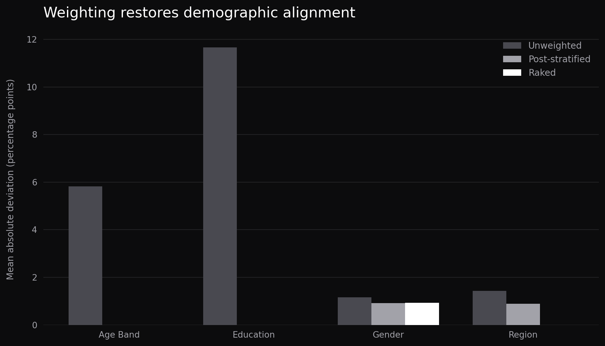
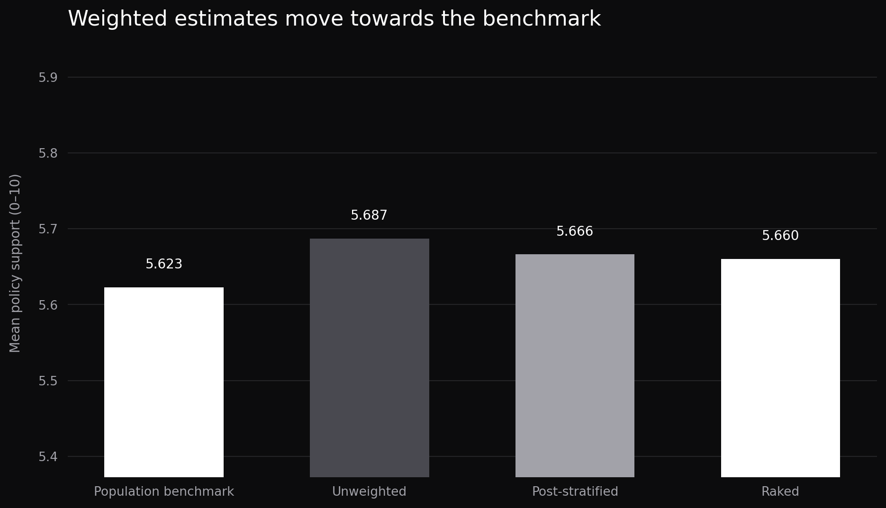
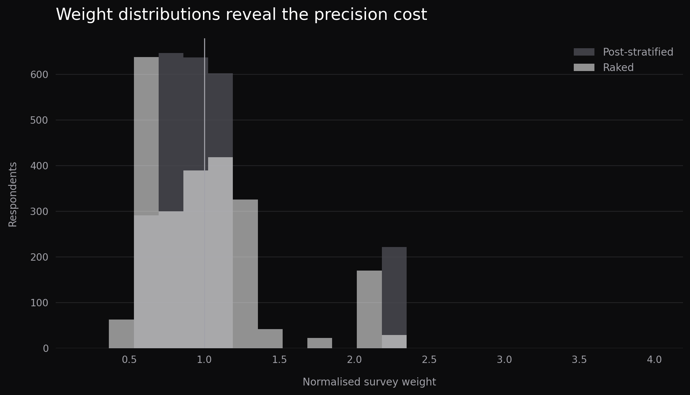

# Demographic Weighting Exercise

## Project Snapshot

| Project type | Dataset | Tools | Outputs |
|---|---|---|---|
| Simulated Quantitative Case Study | 60,000-Person Synthetic UK Adult Population; 2,400-Person Achieved Survey Sample | Python / Pandas / NumPy / Matplotlib | Benchmark Audit; Post-stratification; Raking; Weighted Estimates; Design-Effect Diagnostics; Dark Figures |

**Skills demonstrated:** Data Weighting · Statistical Analysis · Sampling · Data Cleaning · Data Validation · Cross-tabulation

## Study Context

This simulated case study starts with a known UK adult population and an achieved survey sample whose selection process overrepresents working-age, degree-educated and London respondents. The population totals are treated as external benchmark controls. All values are synthetic and are not estimates of the real UK population.

## Objective and Method

The study audits unweighted composition, applies two adjustment strategies, and tests whether demographic correction improves a mean policy-support estimate. Post-stratification calibrates the joint age-by-education cells. Iterative proportional fitting (raking) calibrates age, region and education margins, with normalised weights capped at 4.0. Validation checks cover schema, unique identifiers, missing outcomes and expected sample counts.

## Composition Audit

| Benchmark variable | Unweighted mean absolute difference | Post-stratified | Raked |
|---|---:|---:|---:|
| Age Band | 5.82 pp | 0.00 pp | 0.00 pp |
| Education | 11.66 pp | 0.00 pp | 0.00 pp |
| Gender | 1.16 pp | 0.91 pp | 0.93 pp |
| Region | 1.44 pp | 0.89 pp | 0.00 pp |

Post-stratification exactly aligns age and education jointly but leaves region imbalance. Raking aligns all three specified margins; gender remains an audit variable rather than a weighting control, illustrating that calibration only guarantees balance on included benchmarks.

## Weighted and Unweighted Estimates

| Estimate | Mean policy support | Bias versus population |
|---|---:|---:|
| Population benchmark | 5.623 | — |
| Unweighted sample | 5.687 | +0.064 |
| Post-stratified sample | 5.666 | +0.043 |
| Raked sample | 5.660 | +0.037 |

Post-stratification reduces absolute bias by 32.2%; raking reduces it by 41.9%. The correction works because the outcome is associated with demographics that also shaped selection, but neither method can guarantee removal of selection effects within weighting cells.

## Weight Diagnostics and Bias–Variance Trade-off

| Method | Minimum | Median | 95th percentile | Maximum | Design effect | Effective sample size |
|---|---:|---:|---:|---:|---:|---:|
| Unweighted | 1.00 | 1.00 | 1.00 | 1.00 | 1.000 | 2,400 |
| Post-stratified | 0.64 | 0.89 | 2.33 | 2.33 | 1.202 | 1,997 |
| Raked | 0.50 | 0.93 | 2.06 | 2.31 | 1.170 | 2,052 |

Weighting trades variance for reduced demographic and outcome bias. The raked estimate is closer to the known population value, while unequal weights reduce the nominal 2,400 interviews to an effective sample size of 2,052. The 4.0 cap limits domination by sparse profiles; this protects precision but may leave small residual discrepancies when a target requires more correction.

## Interpretation

For reporting, the raked weight is the preferred general-purpose weight because it matches more benchmark dimensions and achieves the smallest outcome bias in this simulation. Post-stratification remains useful when reliable joint population cells are available, but increasingly granular cells can become sparse. The decision should therefore consider benchmark quality, cell size, extreme weights, effective sample size and whether the weighting variables plausibly explain both selection and the outcome.

## Figures

### Composition before and after weighting

### Weighted and unweighted estimates

### Weight distributions

## Project Files

- [`data/weighting_population.csv.gz`](data/weighting_population.csv.gz) — known synthetic population with achieved-sample indicator.
- [`data/weighting_codebook.csv`](data/weighting_codebook.csv) — variable definitions.
- [`data/weighting_scenario.csv`](data/weighting_scenario.csv) — deterministic simulation and weighting parameters.
- [`outputs/respondents_weighted.csv`](outputs/respondents_weighted.csv) — respondent-level file with both final weights.
- [`outputs/population_benchmarks.csv`](outputs/population_benchmarks.csv) — benchmark, unweighted and weighted composition shares.
- [`outputs/estimate_comparison.csv`](outputs/estimate_comparison.csv) — benchmark and survey estimates with bias.
- [`outputs/weight_diagnostics.csv`](outputs/weight_diagnostics.csv) — weight percentiles, design effects and effective sample sizes.
- [`outputs/weighted_crosstabs.csv`](outputs/weighted_crosstabs.csv) — age-by-education estimates for validation and interpretation.
